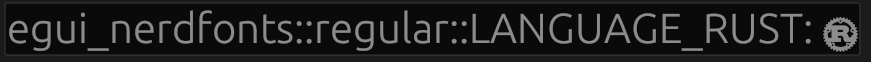

# egui_nerdfonts

Bundles [Nerd Fonts icons](https://www.nerdfonts.com/cheat-sheet) for [egui](https://github.com/emilk/egui).


## Installation

Add the crate as a dependency in Cargo.toml:
```toml
egui_nerdfonts = "0.1.1"
```

or type `cargo add egui_nerdfonts`, in your project.

## Usage

First, update the fonts in your egui context:

```rust
let mut fonts = egui::FontDefinitions::default();
egui_nerdfonts::add_to_fonts(&mut fonts, egui_nerdfonts::Variant::Regular);

let egui_ctx = Context::default();
egui_ctx.set_fonts(fonts);
```

Choose nerdfonts icons you want to use among [these](https://www.nerdfonts.com/cheat-sheet).

Then use nerdfonts icons as follow:

```rust
ui.label(format!("{}", egui_nerdfonts::regular::NF_DEV_RUST));
```

## Example

```
cargo run --example rust_logo
```



## About

Got inspired by [egui_phosphor](https://github.com/amPerl/egui-phosphor), code uses the same structure.

The .ttf used is [this one](https://github.com/ryanoasis/nerd-fonts/releases/download/v3.0.2/NerdFontsSymbolsOnly.zip), and the `src/variants/regular.rs` was generated with the following python script, with the `nerdfonts_regular.ttf` as first argument:

```python
from itertools import chain
from fontTools.ttLib import TTFont
from fontTools.unicode import Unicode
import sys

with TTFont(
    sys.argv[1], 0, allowVID=0, ignoreDecompileErrors=True, fontNumber=-1
) as ttf:
    chars = chain.from_iterable(
        [y + (Unicode[y[0]],) for y in x.cmap.items()] for x in ttf["cmap"].tables
    )
    for char in chars:
        symbol_name = char[1].upper().replace('-', '_').replace(' ', '_').replace('#', '_').replace('!', '')
        code = r"\u" + "{" + f"{char[0]:X}" + "}"
        print(f"pub const {symbol_name}: &str = \"{code}\";")
```